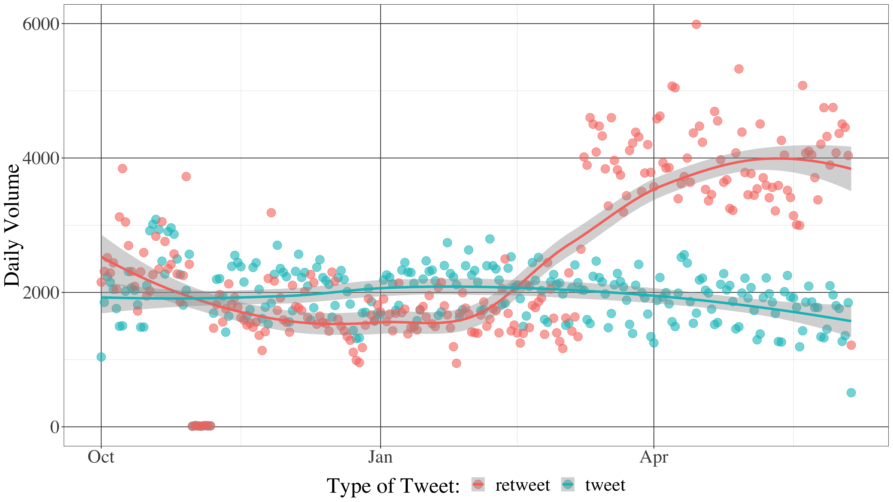

```{r setup, include=FALSE}
usethis::use_git_ignore(c("*.csv", "*.rds"))
options(htmltools.dir.version = FALSE)

# see options for customize slides: 
# https://slides.yihui.name/xaringan/
# https://slides.yihui.name/xaringan/incremental.html
# https://github.com/yihui/xaringan/wiki

library(knitr)
library(tidyverse)
library(xaringan)
```

class: inverse, left, top

**Access my slide deck here:**  
### https://bretsw.github.io/brownbag-nov2019/

**Follow me on Twitter:**  
### [@bretsw](https://twitter.com/bretsw)

---

class: inverse, center, middle

# Twitter in Education

---

# Twitter Effects: Group Behavior

```{r, out.width = "720px", echo = FALSE, fig.align = "center"}

```

---

# Twitter Effects: Alone Together

```{r, out.width = "720px", echo = FALSE, fig.align = "center"}

```

---

# Twitter Effects: Identity and Anonymity

```{r, out.width = "720px", echo = FALSE, fig.align = "center"}

```

---

# Twitter Effects: Mediated Reality

```{r, out.width = "720px", echo = FALSE, fig.align = "center"}
include_graphics("img/mediated-reality.jpg")
```

---

# Twitter Effects: Pithy Soundbytes

```{r, out.width = "720px", echo = FALSE, fig.align = "center"}

```

---

# Twitter Effects: Self-promotion

```{r, out.width = "720px", echo = FALSE, fig.align = "center"}

```

---

# Twitter Benefits: Professional Learning

```{r, out.width = "560px", echo = FALSE, fig.align = "center"}
include_graphics("img/learning.jpg")
```

--

1. Resources

--

1. Emotional support

--

1. Collaboration

---

class: inverse, center, middle

# Problem: The Twitter Kludge

---

# Problem: The Twitter Kludge

```{r, out.width = "520px", echo = FALSE, fig.align = "center"}

```

--

1. Volume

--

1. Mishmash of content

--

1. Mashup of features

---

# Tweets

```{r, out.width = "600px", echo = FALSE, fig.align = "center"}
include_graphics("img/tweet-example.png")
```

---

# Hashtags

```{r, out.width = "300px", echo = FALSE, fig.align = "center"}
include_graphics("img/hashtag.jpg")
```

### Many different uses!

* topical index: #Teaching

--

* humor and wit: #CoolTeacher

--

* synchronous chats: #SatChat

--

* "space" for ongoing discussions: #Edchat, #ITeachMath

---

# Threads

```{r, out.width = "420px", echo = FALSE, fig.align = "center"}

```

---

class: inverse, center, middle

# #Edchat is...

"...Twitter discussion that any educator can discuss and learn about current teaching trends, to integrate technology, to transform their education, and to connect with inspiring instructors around the world."

**Tuesdays 7:00-8:00pm EST**  
on Twitter

---

class: inverse, center, middle

# Research Purpose

The purpose of this study was to understand how educators are talking to each in the Twitter affinity space #Edchat.

---

# Research Questions

```{r, out.width = "480", echo = FALSE, fig.align = "center"}
include_graphics("img/question.jpg")
```

--

1. **Volume** of #Edchat tweets

--

1. **Content** interactions in the mishmash of content

--

1. **Social** interactions in the hashtag-thread mashup

---

class: inverse, center, middle

# Method

---

# Data Collection

```{r, out.width = "480", echo = FALSE, fig.align = "center"}

```

--

* I collected tweets with a `Twitter Archiving Google Sheet (TAGS)` (Hawksey, 2014)

--

  * all tweets containing the keyword text "#edchat"

--

  * October 1, 2017 to June 5, 2018 (8 months)

--

* I obtained tweet metadata using the `rtweet` R package (Kearney, 2018)

---

class: inverse, center, middle

# Results

---

# Results: RQ1. Volume

--

* 175,474 distinct tweeters

--

* 1,111,643 unique tweets

--

* 19,363 tweeters contributed at least monthly to #Edchat

--

* 53.11% of tweeters contributed only one retweet to #Edchat

--

* Tweets per month per user:

--

  * Mean = 0.78 (SD = 9.50)
  * Median = 0.12
  * Range = 0.12 to 2636.42

---

# Results: RQ1. Volume

```{r, out.width = "800", echo = FALSE, fig.align = "center"}

```

---

# Results: RQ2. Content Interactions

--

* Tweets with the #Edchat hashtag alone: 13.32%

--

* Hashtags per tweet:
  * Mean = 4.13 (SD = 3.22)
  * Median = 3
  * Range = 0 to 31

--

* other common hashtags alongside #Edchat:
  * **General interest:** #edtech, #education, #teaching
  * **Position:** #teachers, #edadmin
  * **Level:** #k12, #highered, #elemchat
  * **Subject:** #mathchat, #engchat, #stem
  * **Geography:** #ukedchat, #ausieed
  * **Branded:** #joyfulleaders, #kidsdeserveit, #tlap

---

# Results: RQ3. Social Interactions

--

* 10,381 replies in #Edchat

--

* 2,848 people (1.62% of all #Edchat tweeters) replied to someone
  * 1,136 (0.65% of all #Edchat tweeters) replied more than once

--

* Replies per replier:
  * Mean = 3.65 (SD = 16.29)
  * Median = 1
  * Range = 1 to 637

---

# Results: RQ3. Social Interactions

I reconstructed the #Edchat hashtag-thread mashup and found 2,795 new replies.

--

Thus, the volume in the #Edchat hashtag-thread mashup was:
* 13,176 replies from 3,672 tweeters
* 79.18% contained the #Edchat hashtag
  * 10,433 with; 2,743 without

--

**Table 1.** Comparing Tweets in the #Edchat Hashtag-Thread Mashup

```{r, eval=TRUE, echo= FALSE, message=FALSE}
table1 <- read.csv("table_with_without.csv", header=TRUE)
knitr::kable(table1, format = "html",
             col.names=c("With #Edchat", "Sync %", "Self-reply %",
                         "Words", "Characters", "Sentiment", "Hashtags",
                         "Links", "Likes", "RTs", "Replies"))
```

---

# Results: RQ3. Tweet Purpose

```{r, out.width = "800", echo = FALSE, fig.align = "center"}

```

---

# Results: RQ3. Tweet Discourse

```{r, out.width = "800", echo = FALSE, fig.align = "center"}

```

---

# Results: RQ3. Social Network

--

* 6,171 nodes and 13,176 edges

--

* Diameter = 18

--

* Transitivity = 4.72%

--

* Reciprocity = 29.19%

--

* Degree centrality
  * Mean = 3.47 (SD = 20.15)
  * Median = 1
  * Range = 0 to 1,053

---

# Results: RQ3. Social Network

Keyword #Edchat: blue edges = with; red edges = without

```{r, out.width = "520px", echo = FALSE, fig.align = "center"}
include_graphics("img/edchat_hashtag_thread_mashup.png")
```

---

class: inverse, center, middle

# Discussion

---

class: center

# Find Your Niche

```{r, out.width = "720px", echo = FALSE, fig.align = "center"}

```

--

**How should teachers navigate Twitter's volume?**

--

*BIGGER IS NOT BETTER*

---

class: center

# Find Intersections

```{r, out.width = "600px", echo = FALSE, fig.align = "center"}

```

--

**How should teachers engage content on Twitter?**

--

*LEARNING SPACES ARE NOT ISOLATED*

---

class: center

# Research Like a Participant (#RLAP)

```{r, out.width = "600px", echo = FALSE, fig.align = "center"}

```

###### Photo credit: https://www.flickr.com/photos/larskflem/2472709843

--

**How should researchers understand learning contexts on Twitter?**

--

*USERS DON'T FOLLOW DESIGN*

---

class: inverse, center, middle

# What are your learners’ experiences of volume, mishmash of content, and mashup of features?

*(Audience Discussion)*

--

1. How do you understand your research context?
1. How does this compare to your participants' experiences?
1. Has this been affected by technologies like social media?

---

class: inverse, center, middle

# Questions?

Bret Staudt Willet: [staudtwi@msu.edu](mailto:staudtwi@msu.edu)  

The Github repository for this presentation is  
https://github.com/bretsw/brownbag-nov2019